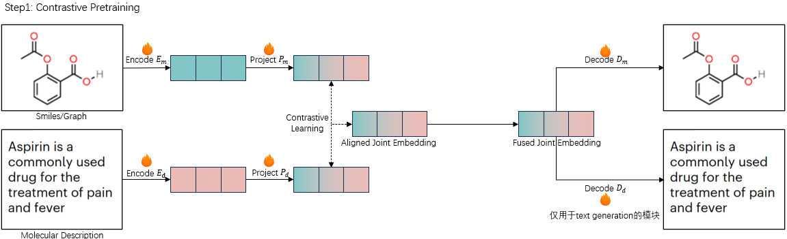
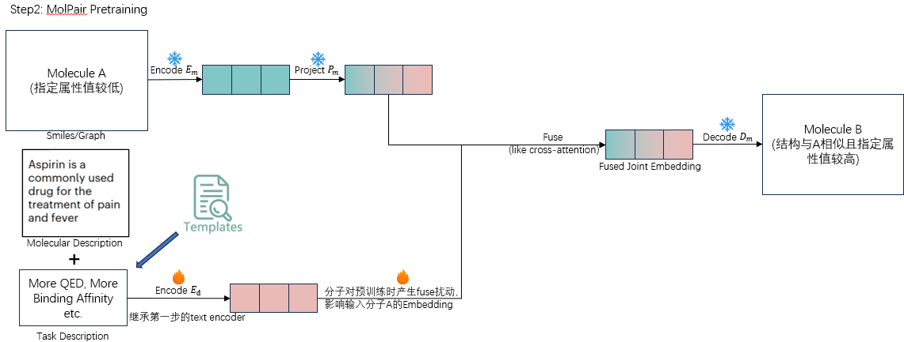
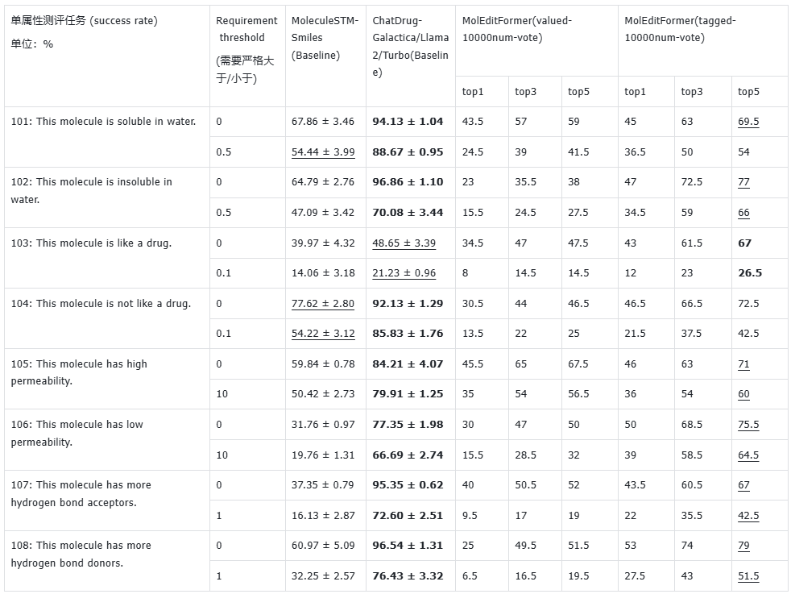
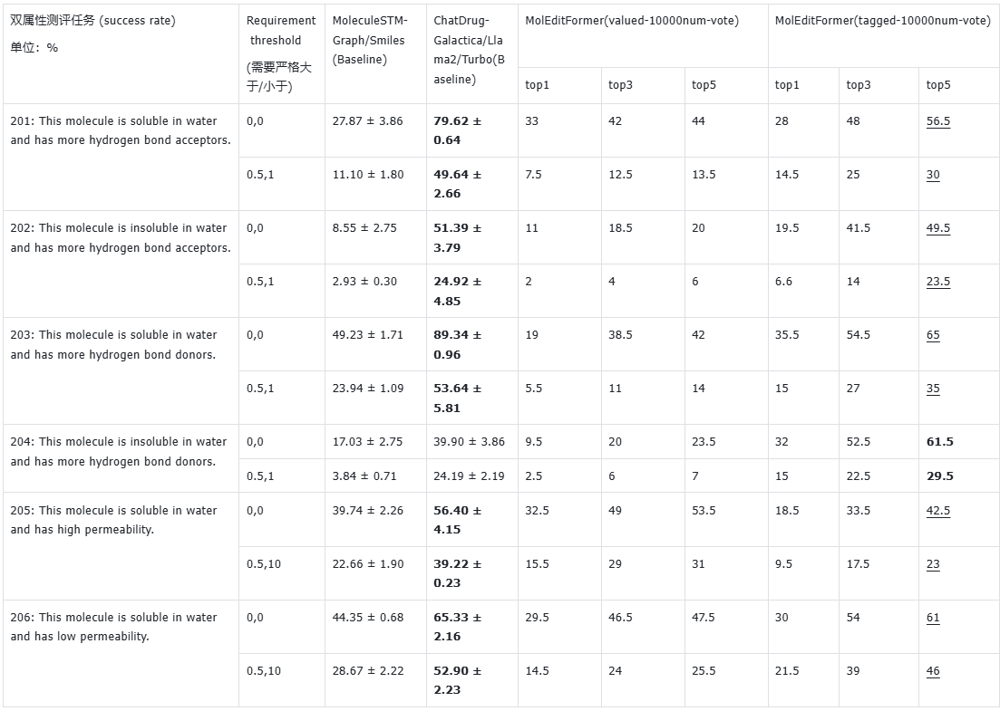

# MolEditFormer: Multi-modal Molecular Editing with Transformer

[English](#english) | [中文](#中文)

---

<a name="english"></a>
# English

## Overview

MolEditFormer is a multi-modal molecular model designed for molecular editing tasks. The model leverages contrastive learning to align the embedding space between natural language and molecular representations, enabling intelligent molecular editing based on text instructions.

**Key Features:**
- Multi-modal alignment between text and molecular representations
- Support for both single-property and multi-property molecular editing
- Pretrain-then-finetune training paradigm

**Training Pipeline:**
1. **Pretrain**: Contrastive learning to align text-molecule embedding space, with simultaneous decoder training
2. **Finetune**: Task-specific fine-tuning on molecular editing pairs

> ***Note: Checkpoints, datasets and guidance about how to reproduce results will be released after acceptance. Coming soon...***

---

## Framework

MolEditFormer is pretrained in Contrastive Learning way to align embedding space between natural language and molecular description. In this procedure, decoders of each modality will be trained simultaneously. Pretrain Procedure will empower model to conduct modality translation.

<p align="center">

</p>

After getting decoder of joint embedding space, the branch of natural language is finetuned in molecular pairs with specific tasks. Finetune Procedure will empower model to conduct molecular editing based on input molecule and task description.

<p align="center">

</p>

---

## Project Structure

```
MolEditFormer/
├── setup.py                       # Package installation script
├── conda_env.md                   # Conda environment setup instructions
├── Dockerfile                     # Docker image build file
├── data_exploration.ipynb         # Data exploration notebook
├── data_exploration.py            # Data exploration script
│
├── MolEditFormer/                 # Main package directory
│   ├── __init__.py
│   ├── smiles_pretrain.py         # Pretrain script (contrastive learning)
│   ├── smiles_finetune.py         # Finetune script (molecular editing)
│   ├── smiles_molecular_edit.py   # Inference script for molecular editing
│   ├── smiles_reconstruct.py      # SMILES reconstruction evaluation
│   ├── smiles_docking_finetune.py        # Docking-based finetuning
│   ├── smiles_docking_molecular_edit.py  # Docking-based editing
│   ├── smiles_pretrain_similarity.py     # Similarity analysis
│   │
│   ├── models/                    # Model implementations
│   │   ├── __init__.py
│   │   ├── model_pretrain.py      # MolEditFormer_pretrain class
│   │   ├── model_finetune.py      # MolEditFormer_finetune class
│   │   ├── model_utils.py         # Model utilities (tokenizer, etc.)
│   │   ├── mega_molbart/          # MegaMolBART backbone
│   │   └── bpe_simple_vocab_16e6.txt.gz  # BPE vocabulary
│   │
│   ├── datasets/                  # Dataset implementations
│   │   ├── __init__.py
│   │   ├── dataset_utils.py       # Dataset utilities and templates
│   │   ├── MolPair.py             # Molecular pair dataset for finetuning
│   │   └── PubChemEdit_ZINC250k.py # PubChemEdit + ZINC250k for pretrain
│   │
│   └── utils/                     # Utility functions
│       ├── basic_utils.py         # Logger, seed_all, etc.
│       ├── molecule_edit_utils.py # Evaluation metrics for molecular editing
│       ├── sascorer.py            # Synthetic accessibility scorer
│       ├── PlogP.py               # Penalized logP calculation
│       └── fpscores.pkl.gz        # Fingerprint scores data
│
├── scripts/                       # Training and evaluation scripts
│   ├── pretrain.sh                # Basic pretrain script
│   ├── pretrain_finetune.sh       # Full pretrain + finetune pipeline
│   ├── smiles_molecular_edit.sh   # Molecular editing inference
│   ├── smiles_reconstruct.sh      # Reconstruction evaluation
│   └── optimal_scripts/           # Optimized scripts
│
├── ckpt/                          # Checkpoints (generated during training)
│   ├── SciBERT/                   # Pretrained SciBERT model
│   ├── MegaMolBART/               # Pretrained MegaMolBART model
│   └── MolEditFormer/             # Trained model checkpoints
│       ├── pretrain/              # Pretrain checkpoints
│       ├── finetune/              # Finetune checkpoints
│       └── inference/             # Inference results
│
├── data/                          # Training and evaluation data
│   ├── PubChemEdit_ZINC250k/      # Pretrain data
│   └── MolPair/                   # Finetune data (molecular pairs)
│
├── template/                      # Prompt templates
│   └── scaffold_template.txt      # Scaffold-based editing templates
│
├── figures/                       # Figures for README
│   ├── pretrain.png
│   ├── finetune.png
│   ├── single_prop_edit.png
│   └── double_prop_edit.png
│
└── test/                          # Test scripts
```

### Important Notes

**Core Files:**

| File | Description |
|------|-------------|
| `setup.py` | Package installation configuration |
| `conda_env.md` | Environment setup instructions |
| `Dockerfile` | Docker build configuration |
| `data_exploration.ipynb` | Data analysis and visualization |

**Molecule Types:**

| Type | Description |
|------|-------------|
| `SMILES` | SMILES string representation (default) |
| `2DGraph` | 2D molecular graph with GNN encoder |

---

## Environment Setup

### Option 1: Conda Environment

Please refer to `conda_env.md` for detailed instructions.

```bash
# Create conda environment
conda create -n MolEditFormer python=3.7
conda activate MolEditFormer

# Install RDKit
pip install rdkit

# Install CUDA toolkit
conda install -c conda-forge cudatoolkit=11.1

# Install PyTorch (CUDA 11.1)
pip install torch==1.9.1+cu111 torchvision==0.10.1+cu111 torchaudio==0.9.1 \
    -f https://download.pytorch.org/whl/torch_stable.html

# Install PyTorch Geometric
python -m pip install --no-cache-dir -i https://pypi.org/simple torch-geometric==2.0.3
python -m pip install --no-cache-dir --only-binary=:all: \
    -f https://data.pyg.org/whl/torch-1.9.1+cu111.html \
    torch-scatter==2.0.9 torch-sparse==0.6.12 torch-cluster==1.5.9 torch-spline-conv==1.2.1

# Install other dependencies
pip install tensorboardX requests tqdm matplotlib spacy==3.4.4 Levenshtein

# Install SciBERT dependencies
pip install boto3 transformers==4.26.1

# Install MoleculeNet dependencies
pip install ogb==1.2.0

# Install pysmilesutils
python -m pip install git+https://github.com/MolecularAI/pysmilesutils.git

# Install DeepSpeed
pip install deepspeed==0.7.2

# Install Megatron
git clone https://github.com/MolecularAI/MolBART.git --branch megatron-molbart-with-zinc
cd MolBART/megatron_molbart/Megatron-LM-v1.1.5-3D_parallelism
pip install .
cd ../../..

# Install Apex
git clone https://github.com/chao1224/apex.git
cd apex
pip install -v --disable-pip-version-check --no-cache-dir \
    --global-option="--cpp_ext" --global-option="--cuda_ext" ./
cd ..

pip install ftfy

# Install MolEditFormer package
pip install -e .
```

### Option 2: Docker

```bash
# Build Docker image
docker build -t moleditformer:latest .

# Run container
docker run -it --gpus all -v $(pwd):/workspace moleditformer:latest
```

---

## Training Pipeline

### Stage 1: Pretrain (Contrastive Learning)

**Purpose**: Align the embedding space between text descriptions and molecular representations through contrastive learning.

**Training Script**: `MolEditFormer/smiles_pretrain.py`

```bash
python3 -m MolEditFormer.smiles_pretrain \
    --model_mode pretrain \
    --text_tokenizer_dir ckpt/SciBERT \
    --mol_model_path ckpt/MegaMolBART/model_weight.pth \
    --dataset_mode main \
    --data_dir data/PubChemEdit_ZINC250k/v2 \
    --value_type discrete \
    --property_type name \
    --batch_size 16 \
    --mixed \
    --scaffold_hint \
    --store_dir ckpt/MolEditFormer/pretrain \
    --dir_name Pretrain-Experiment \
    --validation_ratio 0.05 \
    --epoch_num 10 \
    --alpha 1.0 \
    --text_lr 2e-5 \
    --graph_lr 2e-5 \
    --seed 42 \
    --gpu 0
```

**Key Parameters**:

| Parameter | Description | Default |
|-----------|-------------|---------|
| `--text_tokenizer_dir` | SciBERT tokenizer path | `ckpt/SciBERT` |
| `--mol_model_path` | MegaMolBART checkpoint path | - |
| `--data_dir` | Pretrain data directory | - |
| `--mixed` | Enable mixed training (PubChemEdit + ZINC250k) | `False` |
| `--scaffold_hint` | Include scaffold information in prompts | `False` |
| `--alpha` | Loss weight for contrastive loss | `1.0` |
| `--text_lr` | Learning rate for text encoder | `2e-5` |
| `--graph_lr` | Learning rate for molecule encoder | `2e-5` |

**Output Checkpoints**:
- `best_text_model.pth` - Text encoder weights
- `best_molecule_model.pth` - Molecule encoder/decoder weights
- `best_text2latent.pth` - Text projection layer
- `best_mol2latent.pth` - Molecule projection layer

---

### Stage 2: Finetune (Molecular Editing)

**Purpose**: Train the model on molecular editing pairs to learn task-specific transformations.

**Training Script**: `MolEditFormer/smiles_finetune.py`

```bash
python3 -m MolEditFormer.smiles_finetune \
    --log_freq 500 \
    --model_mode finetune \
    --text_tokenizer_dir ckpt/SciBERT \
    --text_model_path ckpt/MolEditFormer/pretrain/YOUR_PRETRAIN_DIR/best_text_model.pth \
    --mol_model_path ckpt/MolEditFormer/pretrain/YOUR_PRETRAIN_DIR/best_molecule_model.pth \
    --text_projector_path ckpt/MolEditFormer/pretrain/YOUR_PRETRAIN_DIR/best_text2latent.pth \
    --mol_projector_path ckpt/MolEditFormer/pretrain/YOUR_PRETRAIN_DIR/best_mol2latent.pth \
    --scaffold_hint \
    --template_path template/scaffold_template.txt \
    --dataset_mode main \
    --value_type discrete \
    --property_type name \
    --data_dir data/MolPair/mol_pair/v2 \
    --max_num_pairs_per_task 10000 \
    --batch_size 16 \
    --store_dir ckpt/MolEditFormer/finetune \
    --dir_name Finetune-Experiment \
    --num_layers 4 \
    --num_heads 8 \
    --dropout 0.1 \
    --validation_ratio 0.05 \
    --epoch_num 20 \
    --text_lr 2e-5 \
    --fuser_lr 1e-4 \
    --seed 42 \
    --gpu 0
```

**Key Parameters**:

| Parameter | Description | Default |
|-----------|-------------|---------|
| `--text_model_path` | Pretrained text encoder path | - |
| `--mol_model_path` | Pretrained molecule model path | - |
| `--text_projector_path` | Pretrained text projector path | - |
| `--mol_projector_path` | Pretrained molecule projector path | - |
| `--template_path` | Prompt template file path | - |
| `--num_layers` | Number of fuser transformer layers | `4` |
| `--num_heads` | Number of attention heads | `8` |
| `--fuser_lr` | Learning rate for modality fuser | `1e-4` |
| `--max_num_pairs_per_task` | Max samples per editing task | `10000` |

**Output Checkpoints**:
- `best_text_model.pth` - Finetuned text encoder
- `best_modality_fuser.pth` - Modality fuser weights

---

### Stage 3: Inference (Molecular Editing)

**Purpose**: Apply the trained model to edit molecules based on text instructions.

**Inference Script**: `MolEditFormer/smiles_molecular_edit.py`

```bash
# Single property editing tasks (task_id: 101-108)
python3 -m MolEditFormer.smiles_molecular_edit \
    --model_mode edit \
    --text_model_path ckpt/MolEditFormer/finetune/YOUR_FINETUNE_DIR/best_text_model.pth \
    --mol_model_path ckpt/MolEditFormer/pretrain/YOUR_PRETRAIN_DIR/best_molecule_model.pth \
    --fuser_path ckpt/MolEditFormer/finetune/YOUR_FINETUNE_DIR/best_modality_fuser.pth \
    --data_dir data/MolPair/mol_pair/zero_shot \
    --task_id 101 \
    --dataset_mode iterative \
    --store_dir ckpt/MolEditFormer/inference/edit \
    --dir_name Inference-Experiment \
    --sampling_alg greedy \
    --batch_size 48 \
    --seed 42 \
    --gpu 0

# Multi-property editing tasks (task_id: 201-206)
python3 -m MolEditFormer.smiles_molecular_edit \
    --model_mode edit \
    --task_id 201 \
    ...
```

**Task IDs**:

| Task ID | Description |
|---------|-------------|
| 101-108 | Single property editing tasks |
| 201-206 | Multi-property editing tasks |

**Sampling Algorithms**:

| Algorithm | Description |
|-----------|-------------|
| `greedy` | Greedy decoding (default) |
| `beam` | Beam search decoding |

---

## Benchmark Results

### Normal Editing Benchmark

Because ChatDrug is multi-round editing with failure information, it's actually different with other models. We'll change ChatDrug to other baseline or empower our model to conduct multi-round editing.

<p align="center">

</p>

MolEditFormer actually owns advantages in multi-property molecular editing, even compared with ChatDrug.

<p align="center">

</p>

### Docking Editing Benchmark

Waiting for implementation, we'll update result after finding proper ground truth and benchmark, as editing benchmark in Docking is rare, we need to find proper evaluation method on any molecules as our ground truth.

*We find [Boltz-2](https://github.com/jwohlwend/boltz) as our ground truth of receptor affinity values. Fine-tuning and evaluation are in progress.*

---

## Complete Training Workflow

```
┌─────────────────────────────────────────────────────────────────────────────┐
│                              Training Pipeline                               │
├─────────────────────────────────────────────────────────────────────────────┤
│                                                                             │
│  ┌──────────────────┐    ┌──────────────────┐                               │
│  │   SciBERT        │    │   MegaMolBART    │                               │
│  │   (Text Encoder) │    │   (Mol Decoder)  │                               │
│  └────────┬─────────┘    └────────┬─────────┘                               │
│           │                       │                                         │
│           └───────────┬───────────┘                                         │
│                       │                                                     │
│                       ▼                                                     │
│  ┌──────────────────────────────────────────┐                               │
│  │     Stage 1: Pretrain                     │                               │
│  │     (Contrastive Learning)                │                               │
│  │     smiles_pretrain.py                    │                               │
│  │     Data: PubChemEdit + ZINC250k          │                               │
│  └──────┬───────────────────────────────────┘                               │
│         │                                                                   │
│         │  Output: text_model, molecule_model,                              │
│         │          text2latent, mol2latent                                  │
│         │                                                                   │
│         ▼                                                                   │
│  ┌──────────────────────────────────────────┐                               │
│  │     Stage 2: Finetune                     │                               │
│  │     (Molecular Editing)                   │                               │
│  │     smiles_finetune.py                    │                               │
│  │     Data: MolPair                         │                               │
│  └──────┬───────────────────────────────────┘                               │
│         │                                                                   │
│         │  Output: text_model, modality_fuser                               │
│         │                                                                   │
│         ▼                                                                   │
│  ┌──────────────────────────────────────────┐                               │
│  │     Stage 3: Inference                    │                               │
│  │     (Molecular Editing Evaluation)        │                               │
│  │     smiles_molecular_edit.py              │                               │
│  └──────────────────────────────────────────┘                               │
│                                                                             │
└─────────────────────────────────────────────────────────────────────────────┘
```

---

## Data Format

### Pretrain Data (PubChemEdit_ZINC250k)

Text-molecule pairs for contrastive learning:
```json
{"smiles": "CCO", "description": "Ethanol is a simple alcohol with the formula C2H5OH."}
{"smiles": "CC(=O)O", "description": "Acetic acid is a colorless liquid organic compound."}
```

### Finetune Data (MolPair)

Molecular editing pairs with task instructions:
```json
{
    "source_smiles": "CCO",
    "target_smiles": "CCCO",
    "task_id": 101,
    "description": "Increase the logP value of the molecule."
}
```

---

## License

This project is licensed under the [MIT License](LICENSE).

---

---

<a name="中文"></a>
# 中文

## 概述

MolEditFormer 是一个用于分子编辑任务的多模态分子模型。该模型利用对比学习来对齐自然语言和分子表示之间的嵌入空间，从而实现基于文本指令的智能分子编辑。

**核心特性：**
- 文本与分子表示之间的多模态对齐
- 支持单属性和多属性分子编辑
- 预训练-微调的训练范式

**训练流程：**
1. **预训练**：通过对比学习对齐文本-分子嵌入空间，同时训练解码器
2. **微调**：在分子编辑对上进行特定任务的微调

> ***注意：检查点、数据集和复现结果的指南将在论文接收后发布。敬请期待...***

---

## 框架

MolEditFormer 通过对比学习的方式进行预训练，以对齐自然语言和分子描述之间的嵌入空间。在此过程中，每种模态的解码器将同时被训练。预训练过程将赋予模型进行模态转换的能力。

<p align="center">

</p>

在获得联合嵌入空间的解码器后，自然语言分支将在具有特定任务的分子对上进行微调。微调过程将赋予模型根据输入分子和任务描述进行分子编辑的能力。

<p align="center">

</p>

---

## 项目结构

```
MolEditFormer/
├── setup.py                       # 包安装脚本
├── conda_env.md                   # Conda 环境配置说明
├── Dockerfile                     # Docker 镜像构建文件
├── data_exploration.ipynb         # 数据探索笔记本
├── data_exploration.py            # 数据探索脚本
│
├── MolEditFormer/                 # 主包目录
│   ├── __init__.py
│   ├── smiles_pretrain.py         # 预训练脚本（对比学习）
│   ├── smiles_finetune.py         # 微调脚本（分子编辑）
│   ├── smiles_molecular_edit.py   # 分子编辑推理脚本
│   ├── smiles_reconstruct.py      # SMILES 重建评估
│   ├── smiles_docking_finetune.py        # 基于对接的微调
│   ├── smiles_docking_molecular_edit.py  # 基于对接的编辑
│   ├── smiles_pretrain_similarity.py     # 相似度分析
│   │
│   ├── models/                    # 模型实现
│   │   ├── __init__.py
│   │   ├── model_pretrain.py      # MolEditFormer_pretrain 类
│   │   ├── model_finetune.py      # MolEditFormer_finetune 类
│   │   ├── model_utils.py         # 模型工具函数（分词器等）
│   │   ├── mega_molbart/          # MegaMolBART 骨干网络
│   │   └── bpe_simple_vocab_16e6.txt.gz  # BPE 词表
│   │
│   ├── datasets/                  # 数据集实现
│   │   ├── __init__.py
│   │   ├── dataset_utils.py       # 数据集工具和模板
│   │   ├── MolPair.py             # 用于微调的分子对数据集
│   │   └── PubChemEdit_ZINC250k.py # 用于预训练的 PubChemEdit + ZINC250k
│   │
│   └── utils/                     # 工具函数
│       ├── basic_utils.py         # Logger, seed_all 等
│       ├── molecule_edit_utils.py # 分子编辑评估指标
│       ├── sascorer.py            # 合成可及性评分器
│       ├── PlogP.py               # 惩罚 logP 计算
│       └── fpscores.pkl.gz        # 指纹分数数据
│
├── scripts/                       # 训练和评估脚本
│   ├── pretrain.sh                # 基础预训练脚本
│   ├── pretrain_finetune.sh       # 完整预训练 + 微调流程
│   ├── smiles_molecular_edit.sh   # 分子编辑推理
│   ├── smiles_reconstruct.sh      # 重建评估
│   └── optimal_scripts/           # 优化脚本
│
├── ckpt/                          # 检查点（训练时生成）
│   ├── SciBERT/                   # 预训练 SciBERT 模型
│   ├── MegaMolBART/               # 预训练 MegaMolBART 模型
│   └── MolEditFormer/             # 训练好的模型检查点
│       ├── pretrain/              # 预训练检查点
│       ├── finetune/              # 微调检查点
│       └── inference/             # 推理结果
│
├── data/                          # 训练和评估数据
│   ├── PubChemEdit_ZINC250k/      # 预训练数据
│   └── MolPair/                   # 微调数据（分子对）
│
├── template/                      # 提示模板
│   └── scaffold_template.txt      # 基于骨架的编辑模板
│
├── figures/                       # README 图片
│   ├── pretrain.png
│   ├── finetune.png
│   ├── single_prop_edit.png
│   └── double_prop_edit.png
│
└── test/                          # 测试脚本
```

### 重要说明

**核心文件：**

| 文件 | 描述 |
|------|------|
| `setup.py` | 包安装配置 |
| `conda_env.md` | 环境配置说明 |
| `Dockerfile` | Docker 构建配置 |
| `data_exploration.ipynb` | 数据分析与可视化 |

**分子类型：**

| 类型 | 描述 |
|------|------|
| `SMILES` | SMILES 字符串表示（默认） |
| `2DGraph` | 使用 GNN 编码器的 2D 分子图 |

---

## 环境配置

### 方式一：Conda 环境

请参考 `conda_env.md` 获取详细说明。

```bash
# 创建 conda 环境
conda create -n MolEditFormer python=3.7
conda activate MolEditFormer

# 安装 RDKit
pip install rdkit

# 安装 CUDA 工具包
conda install -c conda-forge cudatoolkit=11.1

# 安装 PyTorch（CUDA 11.1）
pip install torch==1.9.1+cu111 torchvision==0.10.1+cu111 torchaudio==0.9.1 \
    -f https://download.pytorch.org/whl/torch_stable.html

# 安装 PyTorch Geometric
python -m pip install --no-cache-dir -i https://pypi.org/simple torch-geometric==2.0.3
python -m pip install --no-cache-dir --only-binary=:all: \
    -f https://data.pyg.org/whl/torch-1.9.1+cu111.html \
    torch-scatter==2.0.9 torch-sparse==0.6.12 torch-cluster==1.5.9 torch-spline-conv==1.2.1

# 安装其他依赖
pip install tensorboardX requests tqdm matplotlib spacy==3.4.4 Levenshtein

# 安装 SciBERT 依赖
pip install boto3 transformers==4.26.1

# 安装 MoleculeNet 依赖
pip install ogb==1.2.0

# 安装 pysmilesutils
python -m pip install git+https://github.com/MolecularAI/pysmilesutils.git

# 安装 DeepSpeed
pip install deepspeed==0.7.2

# 安装 Megatron
git clone https://github.com/MolecularAI/MolBART.git --branch megatron-molbart-with-zinc
cd MolBART/megatron_molbart/Megatron-LM-v1.1.5-3D_parallelism
pip install .
cd ../../..

# 安装 Apex
git clone https://github.com/chao1224/apex.git
cd apex
pip install -v --disable-pip-version-check --no-cache-dir \
    --global-option="--cpp_ext" --global-option="--cuda_ext" ./
cd ..

pip install ftfy

# 安装 MolEditFormer 包
pip install -e .
```

### 方式二：Docker

```bash
# 构建 Docker 镜像
docker build -t moleditformer:latest .

# 运行容器
docker run -it --gpus all -v $(pwd):/workspace moleditformer:latest
```

---

## 训练流程

### 阶段一：预训练（对比学习）

**目的**：通过对比学习对齐文本描述和分子表示之间的嵌入空间。

**训练脚本**：`MolEditFormer/smiles_pretrain.py`

```bash
python3 -m MolEditFormer.smiles_pretrain \
    --model_mode pretrain \
    --text_tokenizer_dir ckpt/SciBERT \
    --mol_model_path ckpt/MegaMolBART/model_weight.pth \
    --dataset_mode main \
    --data_dir data/PubChemEdit_ZINC250k/v2 \
    --value_type discrete \
    --property_type name \
    --batch_size 16 \
    --mixed \
    --scaffold_hint \
    --store_dir ckpt/MolEditFormer/pretrain \
    --dir_name Pretrain-Experiment \
    --validation_ratio 0.05 \
    --epoch_num 10 \
    --alpha 1.0 \
    --text_lr 2e-5 \
    --graph_lr 2e-5 \
    --seed 42 \
    --gpu 0
```

**关键参数**：

| 参数 | 描述 | 默认值 |
|------|------|--------|
| `--text_tokenizer_dir` | SciBERT 分词器路径 | `ckpt/SciBERT` |
| `--mol_model_path` | MegaMolBART 检查点路径 | - |
| `--data_dir` | 预训练数据目录 | - |
| `--mixed` | 启用混合训练（PubChemEdit + ZINC250k） | `False` |
| `--scaffold_hint` | 在提示中包含骨架信息 | `False` |
| `--alpha` | 对比损失的权重 | `1.0` |
| `--text_lr` | 文本编码器学习率 | `2e-5` |
| `--graph_lr` | 分子编码器学习率 | `2e-5` |

**输出检查点**：
- `best_text_model.pth` - 文本编码器权重
- `best_molecule_model.pth` - 分子编码器/解码器权重
- `best_text2latent.pth` - 文本投影层
- `best_mol2latent.pth` - 分子投影层

---

### 阶段二：微调（分子编辑）

**目的**：在分子编辑对上训练模型，学习特定任务的转换。

**训练脚本**：`MolEditFormer/smiles_finetune.py`

```bash
python3 -m MolEditFormer.smiles_finetune \
    --log_freq 500 \
    --model_mode finetune \
    --text_tokenizer_dir ckpt/SciBERT \
    --text_model_path ckpt/MolEditFormer/pretrain/YOUR_PRETRAIN_DIR/best_text_model.pth \
    --mol_model_path ckpt/MolEditFormer/pretrain/YOUR_PRETRAIN_DIR/best_molecule_model.pth \
    --text_projector_path ckpt/MolEditFormer/pretrain/YOUR_PRETRAIN_DIR/best_text2latent.pth \
    --mol_projector_path ckpt/MolEditFormer/pretrain/YOUR_PRETRAIN_DIR/best_mol2latent.pth \
    --scaffold_hint \
    --template_path template/scaffold_template.txt \
    --dataset_mode main \
    --value_type discrete \
    --property_type name \
    --data_dir data/MolPair/mol_pair/v2 \
    --max_num_pairs_per_task 10000 \
    --batch_size 16 \
    --store_dir ckpt/MolEditFormer/finetune \
    --dir_name Finetune-Experiment \
    --num_layers 4 \
    --num_heads 8 \
    --dropout 0.1 \
    --validation_ratio 0.05 \
    --epoch_num 20 \
    --text_lr 2e-5 \
    --fuser_lr 1e-4 \
    --seed 42 \
    --gpu 0
```

**关键参数**：

| 参数 | 描述 | 默认值 |
|------|------|--------|
| `--text_model_path` | 预训练文本编码器路径 | - |
| `--mol_model_path` | 预训练分子模型路径 | - |
| `--text_projector_path` | 预训练文本投影器路径 | - |
| `--mol_projector_path` | 预训练分子投影器路径 | - |
| `--template_path` | 提示模板文件路径 | - |
| `--num_layers` | 融合 Transformer 层数 | `4` |
| `--num_heads` | 注意力头数 | `8` |
| `--fuser_lr` | 模态融合器学习率 | `1e-4` |
| `--max_num_pairs_per_task` | 每个编辑任务的最大样本数 | `10000` |

**输出检查点**：
- `best_text_model.pth` - 微调后的文本编码器
- `best_modality_fuser.pth` - 模态融合器权重

---

### 阶段三：推理（分子编辑）

**目的**：应用训练好的模型，根据文本指令编辑分子。

**推理脚本**：`MolEditFormer/smiles_molecular_edit.py`

```bash
# 单属性编辑任务（task_id: 101-108）
python3 -m MolEditFormer.smiles_molecular_edit \
    --model_mode edit \
    --text_model_path ckpt/MolEditFormer/finetune/YOUR_FINETUNE_DIR/best_text_model.pth \
    --mol_model_path ckpt/MolEditFormer/pretrain/YOUR_PRETRAIN_DIR/best_molecule_model.pth \
    --fuser_path ckpt/MolEditFormer/finetune/YOUR_FINETUNE_DIR/best_modality_fuser.pth \
    --data_dir data/MolPair/mol_pair/zero_shot \
    --task_id 101 \
    --dataset_mode iterative \
    --store_dir ckpt/MolEditFormer/inference/edit \
    --dir_name Inference-Experiment \
    --sampling_alg greedy \
    --batch_size 48 \
    --seed 42 \
    --gpu 0

# 多属性编辑任务（task_id: 201-206）
python3 -m MolEditFormer.smiles_molecular_edit \
    --model_mode edit \
    --task_id 201 \
    ...
```

**任务 ID**：

| 任务 ID | 描述 |
|---------|------|
| 101-108 | 单属性编辑任务 |
| 201-206 | 多属性编辑任务 |

**采样算法**：

| 算法 | 描述 |
|------|------|
| `greedy` | 贪婪解码（默认） |
| `beam` | 束搜索解码 |

---

## 基准测试结果

### 常规编辑基准

由于 ChatDrug 是带有失败信息的多轮编辑，因此与其他模型实际上不同。我们将把 ChatDrug 更换为其他基线或赋予我们的模型进行多轮编辑的能力。

<p align="center">

</p>

MolEditFormer 在多属性分子编辑方面实际上具有优势，即使与 ChatDrug 相比也是如此。

<p align="center">

</p>

### 对接编辑基准

等待实现，我们将在找到合适的真实值和基准后更新结果，由于对接中的编辑基准很少见，我们需要找到适用于任何分子的合适评估方法作为我们的真实值。

*我们发现 [Boltz-2](https://github.com/jwohlwend/boltz) 可作为受体亲和力值的真实值。微调和评估正在进行中。*

---

## 完整训练流程

```
┌─────────────────────────────────────────────────────────────────────────────┐
│                              训练流程                                        │
├─────────────────────────────────────────────────────────────────────────────┤
│                                                                             │
│  ┌──────────────────┐    ┌──────────────────┐                               │
│  │   SciBERT        │    │   MegaMolBART    │                               │
│  │   （文本编码器）  │    │   （分子解码器）  │                               │
│  └────────┬─────────┘    └────────┬─────────┘                               │
│           │                       │                                         │
│           └───────────┬───────────┘                                         │
│                       │                                                     │
│                       ▼                                                     │
│  ┌──────────────────────────────────────────┐                               │
│  │     阶段一：预训练                         │                               │
│  │     （对比学习）                           │                               │
│  │     smiles_pretrain.py                    │                               │
│  │     数据：PubChemEdit + ZINC250k          │                               │
│  └──────┬───────────────────────────────────┘                               │
│         │                                                                   │
│         │  输出：text_model, molecule_model,                                │
│         │        text2latent, mol2latent                                    │
│         │                                                                   │
│         ▼                                                                   │
│  ┌──────────────────────────────────────────┐                               │
│  │     阶段二：微调                           │                               │
│  │     （分子编辑）                           │                               │
│  │     smiles_finetune.py                    │                               │
│  │     数据：MolPair                         │                               │
│  └──────┬───────────────────────────────────┘                               │
│         │                                                                   │
│         │  输出：text_model, modality_fuser                                 │
│         │                                                                   │
│         ▼                                                                   │
│  ┌──────────────────────────────────────────┐                               │
│  │     阶段三：推理                           │                               │
│  │     （分子编辑评估）                       │                               │
│  │     smiles_molecular_edit.py              │                               │
│  └──────────────────────────────────────────┘                               │
│                                                                             │
└─────────────────────────────────────────────────────────────────────────────┘
```

---

## 数据格式

### 预训练数据（PubChemEdit_ZINC250k）

用于对比学习的文本-分子对：
```json
{"smiles": "CCO", "description": "Ethanol is a simple alcohol with the formula C2H5OH."}
{"smiles": "CC(=O)O", "description": "Acetic acid is a colorless liquid organic compound."}
```

### 微调数据（MolPair）

带有任务指令的分子编辑对：
```json
{
    "source_smiles": "CCO",
    "target_smiles": "CCCO",
    "task_id": 101,
    "description": "Increase the logP value of the molecule."
}
```

---

## 许可证

本项目采用 [MIT 许可证](LICENSE)。
